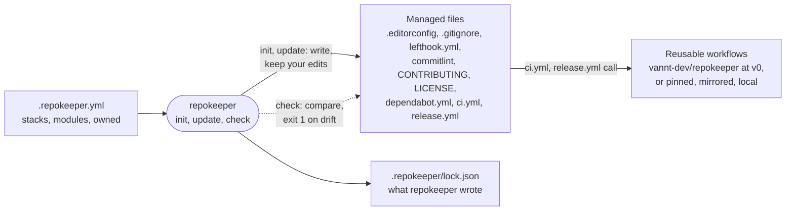

# repokeeper

Keep every repository on one maintained standard: Conventional Commits, git hooks, community health
files, editor and gitignore settings, Dependabot, CI and releases — applied once and kept in sync as
the standard evolves.

> Status: early development. Supported stacks: Node.js (including NestJS), Python, Dart and
> Flutter, shell and PowerShell scripts, Java (Maven and Gradle), Kotlin, .NET, Go, Rust, PHP and
> Ruby, each with CI and releases, plus GitHub settings through `repokeeper github apply`. GitLab is
> supported for Node.js and Go projects, with project settings through `repokeeper gitlab apply`. See the
> [design](docs/superpowers/specs/2026-09-25-repokeeper-design.md).

## How it works



One file describes the repository (`.repokeeper.yml`); repokeeper turns it into the managed files and
remembers what it wrote, so it can tell your edits from its own. `check` only compares; `update`
moves the files to a newer standard and leaves alone what you changed or listed under `owned`.

## Usage

repokeeper is [on npm](https://www.npmjs.com/package/repokeeper). Install it once, or run it without
installing by putting `npx` in front of each command below:

```bash
npm install --global repokeeper
```

To work on repokeeper itself, build it from source and link the command instead:

```bash
git clone https://github.com/vannt-dev/repokeeper.git
cd repokeeper && npm ci && npm run build && npm link
```

Then, in the repository you want to standardise (commit your work first — repokeeper refuses to
write over uncommitted or untracked files unless you pass `--force`):

```bash
repokeeper init     # detect the stack, write .repokeeper.yml, apply the standard
repokeeper check    # report drift; exits 1 when the repository has drifted
repokeeper update   # move to the latest standard without overwriting your edits
```

`init` never overwrites a file you already have: it reports it as unmanaged. Pass
`--adopt <path>` to let repokeeper manage it, or list it under `owned` in `.repokeeper.yml` to keep it
yours. `owned` also takes a single key of a shared file, such as `.github/workflows/ci.yml#on` or
`package.json#devDependencies.lefthook`; repokeeper then leaves that key, and everything under it,
alone. Every write command accepts `--dry-run`.

`init` applies the whole standard unless you say otherwise:

- `repokeeper init --preset essential` writes only the editor settings, `.gitignore` and the CI
  workflow. `standard` is the default. `strict` adds the drift check to CI and, on GitHub, writes
  branch protection (pull requests with one approval, no force push, the commit check required) and
  Dependabot security updates into `.repokeeper.yml`; `repokeeper github apply` then puts them in
  place. There is no preset that promises code or secret scanning: repokeeper does not set those up.
- `repokeeper init --interactive` (or `-i`) asks about each part in turn, naming the files it would
  write, shows the result, and asks once more before writing anything. Enter keeps the preset's
  answer. Add `--dry-run` to go through the questions without the possibility of writing.

Either way the choice ends up as plain `modules:` switches in `.repokeeper.yml`, which you can change
later and apply with `repokeeper update`.

You can also start from the file instead of from detection: put a `.repokeeper.yml` you wrote
yourself in the repository and run `repokeeper init`. When the file is there and repokeeper has not
applied anything yet, `init` applies it as it is written. Nothing is detected, `--stack`,
`--platform` and `--preset` are refused, and the only line it changes is `standard:`, which it sets
to the standard it applied.

The [playground](https://vannt-dev.github.io/repokeeper/) writes that file for you: tick the stacks
and the parts you want, and it shows the `.repokeeper.yml` and the command to run.

`init` reads the default branch from `origin/HEAD` and records it as `github.default_branch` when it
isn't `main`. The release manifest starts from the latest `vX.Y.Z` tag when the stack has no version
of its own.

After writing, repokeeper prints what is left to do (installing the git hooks, and
`git add --renormalize .` when tracked files are stored with CRLF). `init`, `update` and `check` also
point out what they can't fix: `.gitattributes` lines above the repokeeper block that the block
overrides, and pull request workflows of your own that run the same tests as the repokeeper ci job.

Stack notes: Python runs `mypy` on the files its config names (`files = …`), or on the whole tree
otherwise. The dotnet stack needs SDK-style projects; `init` stops with the names of .NET Framework
projects, which the dotnet CLI can't build.

Requires Node.js 22.12 or newer.

## Guides

| Guide | What it covers |
| --- | --- |
| [CI and releases](docs/ci-and-releases.md) | The workflows repokeeper writes, pinning or mirroring the reusable workflows, `repokeeper eject`, script linting, release-please, the drift check |
| [Monorepos](docs/monorepos.md) | Stacks in folders: `stack_options.<stack>.directory`, what runs where, the limits |
| [GitHub settings](docs/github-settings.md) | `repokeeper github apply`: description, topics, merge settings, security, branch protection |
| [GitLab](docs/gitlab.md) | What differs on GitLab, the two jobs that need a token, and `repokeeper gitlab apply`: merge settings, branch protection, the Renovate schedule |

## Pilots

Each stack is tried on a real or demo repository before a release. The demo repositories carry the
[`repokeeper-demo`](https://github.com/topics/repokeeper-demo) topic:
[dart](https://github.com/vannt-dev/repokeeper-demo-dart),
[dotnet](https://github.com/vannt-dev/repokeeper-demo-dotnet),
[go](https://github.com/vannt-dev/repokeeper-demo-go),
[kotlin](https://github.com/vannt-dev/repokeeper-demo-kotlin),
[php](https://github.com/vannt-dev/repokeeper-demo-php),
[ruby](https://github.com/vannt-dev/repokeeper-demo-ruby) and
[rust](https://github.com/vannt-dev/repokeeper-demo-rust).

## License

MIT
